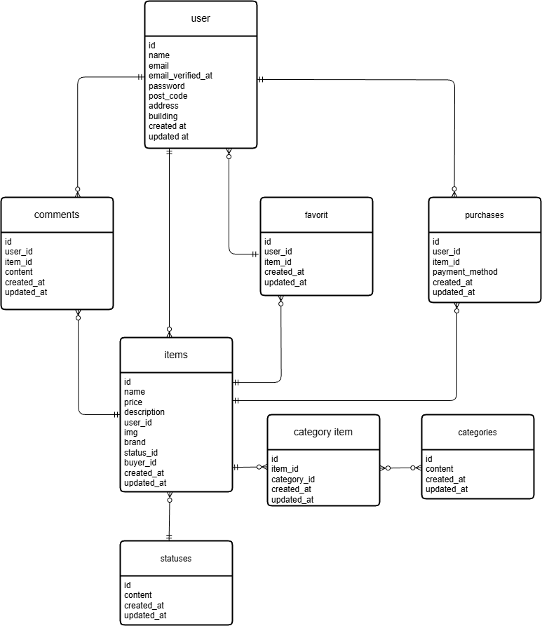

# coachtech-furima

(コーチテック　フリマアプリ)

## 環境構築

**リポジトリをクローン**

1. git clone リポジトリURL
2. cd coachtech-furima

**DockerDesktopアプリを立ち上げる**
```bash
docker-compose up -d
``` 

**Laravel環境構築**

1. docker-compose exec php bash
2. composer install 3.「.env.example」ファイルを 「.env」ファイルに命名を変更。または、新しく.envファイルを作成
3. .envに以下の環境変数を追加

```bash
DB_CONNECTION=mysql
DB_HOST=mysql
DB_PORT=3306
DB_DATABASE=laravel_db
DB_USERNAME=laravel_user
DB_PASSWORD=laravel_pass
```

5.アプリケーションキーの作成
```bash
php artisan key:generate
``` 

6.マイグレーションの実行 
```bash
php artisan migrate
``` 

7.シーディングの実行
```bash
php artisan db:seed
``` 

## 使用技術

・Laravel  
・PHP  
・MySQL  
・Docker  
・Nginx    
・HTML  
・CSS

5.アプリケーションキーの作成
```bash
php artisan key:generate
```  

6.マイグレーションの実行
```bash
php artisan migrate
```  

7.シーディングの実行
```bash
php artisan db:seed
``` 

## 使用技術

- Laravel  
- PHP  
- MySQL  
- Docker
- Nginx    
- HTML  
- CSS

## アプリ概要

ユーザーが商品を出品・購入できるフリマアプリです。
商品へのコメントやお気に入り登録、カテゴリ分類などの機能を実装しています。

## 作成した目的

Laravelの学習のためにフリマアプリを作成しました。ユーザー登録、商品出品、商品購入などの機能を実装しています。

## 主な機能

- 会員登録  
- ログイン機能  
- 商品一覧表示  
- 商品出品  
- 商品購入
- コメント機能  
- カテゴリ機能  
- お気に入り機能   
- プロフィール編集


## ER図



## 配送先住所の保存について

本アプリでは、購入ごとに配送先住所を保持する仕様としています。
そのため purchases テーブルに以下のカラムを追加しています。

* shipping_postcode
* shipping_address
* shipping_name（建物名として使用）

カラム名について再設計の余地がありますが、提出時点では既存機能への影響を考慮し現状の構成としています。


## テーブル仕様書

[テーブル仕様書（Googleスプレッドシート)](https://docs.google.com/spreadsheets/d/1sYa-KjGIGMOXZ0esn_Y6ehyRDO5PhWUPTbimvR6IoaA/edit?gid=1188247583#gid=1188247583)

## URL

- 開発環境：http://localhost
- phpMyAdmin：http://localhost:8080/
